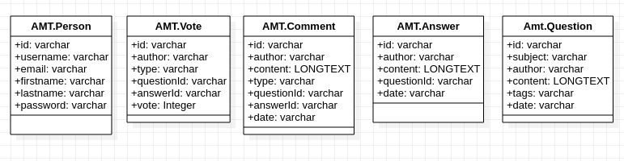

# Project_1

_Jérôme Arn / Canipel Vincent / Clément Semblat / Quentin Saucy_

# Pages du site et fonctionnalités

Dans cette partie, nous allons décrire le fonctionnement des différentes pages de notre serveur d'application:
* La page /login permet de se connecter en rentrant ses identifiants dans le formulaire. Un servlet prendra en compte votre demande via un servlet, une facade et un repository. Ainsi, le serveur d'application vous ouvrira une session.
* La page /register permet de s'enregistrer sur le serveur d'application via un formulaire fait pour. Ainsi, les informations seront conservées dans la base de donnée.
* La page /profile permet de se renseigner sur les différentes statistiques sur le site internet et sur les informations personnelles du compte. Les informations personnelles du compte sont récupérés via le repository Person. Nous avons décidé, pour obtenir les statistiques, d'utiliser les repositories de Question, Answer et Comment afin de bien séparer les tables entre elles et ne pas faire un repository sans table propre du nom de Statistique.
    * A partir de la page profile, nous pouvons atteindre la page de changement de mot de passe, cette page permet de changer de mot de passe en vérifiant le mot de passe actuel et en mettant un place un nouveau mot de passe. Le changement est ensuite statué dans la base de donnée pour l'utilisateur connecté.
    * A partir de la page profile, nous pouvons atteindre la page de changement des informations personnels, cette page permet de modifier les informations personnels sur la base de donnée dans la table Person pour l'utilisateur connecté.
* La page /questions permet de voir les questions dans l'ordre de la question la plus récente à la plus ancienne avec un système de pagination pour éviter de surcharger le serveur.
* En clicquant via la pages /questions sur une question, on atteint le contenue, les réponses et les commentaires de la question choisis. On peut commenter, répondre et voter dans cetter partie de l'application web.
* En cliquant sur "Poser une question" via la liste des questions, on atteint alors la page /ask pour poser une question pour laquelle on peut définir un sujet, un contenu et des tags pour pouvoir être retrouvé plus facilement avec la barre de recherche de tag de la liste des questions.

# Fonctionnement et structure de l'application web

L'application web cherche à séparer les parties de manière distinctes et indépendantes. Ainsi, on retrouve:

* un **tier de présentation** avec le code html et css dans des fichiers jsp qui permettent de mettre en place les vues sur le serveur d'application avec les servlets qui envoient des informations aux fichiers jsp et qui traitent les requêtes des utilisateurs.
* un **tier business** avec les managements facades qui implémentent la logique métier de notre application avec par exemple la connexion d'un utilisateur et la création de sa session.
* un **tier d'intégration** avec les différentes classes repositories qui implémentent la communication avec la base de donnée par l'utilisation d'une jdbc pour MySQL. La classe service registry s'occupe de fournir à la logique métier via de l'injection de dépendance, des accès au tiers d'intégration et donc à la base de donnée.
* un **tier de ressource** avec la base de donnée sur un serveur MySQL.

La base de donnée est un serveur MySQL contenue dans un container docker est ayant un lien avec le container OpenLiberty. En cas de première utilisation, la base de donnée MySQL est créée avec les tables pour pouvoir se rapprocher au maximum d'un lancement clef en main du serveur d'application.

## Arquillian

Malgré de nombreuses tentatives de configuration, les tests d'intégration Arquillian ne fonctionnent que rarement et cela sans réussir à déterminer quel élément de configuration en est la cause. Nous avons laisser les tests "testServiceRegistry" afin que je puissier tout de même voir le travail effectuer.  

```sh
// les commandes pour lancer les tests d'intégration qui ne fonctionne désormais plus 
./arqui.sh
```

## Tests unitaires 

Nous effectuons des tests unitaires sur la plupart des classes sans pour autant avoir le temps de tester tous les cas de figures.

## Tests E2E

Nous effectuons des tests end to end avec un script codecept qui test les principales fonctionalités de notre application (lançables en utilisant e2e.sh).

## Tests JMeter

Nous effectuons des tests de charge avec JMeter (utilisable en lançant le .jmx dans le dossier jmeter_plan) pour tester certaines fonctionalités telles que les créations d'utilisateurs, les logins , les création de questions et les votes.

## Mockito 

Pour simuler certaine classe ainsi que leurs différentes méthodes, nous avons utilisé Mockito. Cela permet de pouvoir tester certaines valeur de retour en fonction du comportement des mock à l'intérieur de la classe testée.  

## Structure DB

La Db se présente sous la forme de cinq simples tables. 


